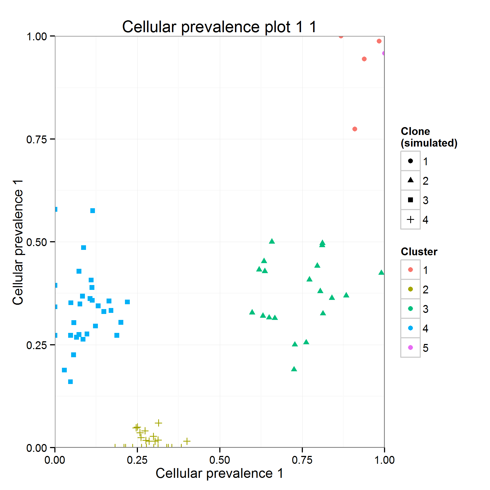

**Github Status :** 

**CRAN Status and statistics :**

# QuantumClone and QuantumCat

R package also available on [CRAN](http://cran.r-project.org/web/packages/QuantumClone/index.html)
Maintainer: Paul Deveau (paul.deveau at curie.fr)

## Clonal Reconstruction from High-Throughput Sequencing data
Beginners instruction are designed so that you don't see a line of code. Use this if you are not familiar with R programming, and thus that you will use the Graphical User Interface (GUI).

Advanced instructions assume you know the basics of programming (downloading and using packages from CRAN).

This Readme is divided in four parts:

[1. Installation instructions ](#IIA)

[2. Usage (Advanced)](#UA) 

###   Installation instructions

The full package is available and is maintained on [CRAN](http://cran.r-project.org/web/packages/QuantumClone/index.html). 

The package can be installed using:
> install.packages("QuantumClone")

or from the GitHub repository using devtools:
> devtools::install_github("DeveauP/QuantumClone")

###   Usage
QuantumClone is looking for clones in your samples assuming that there is an evolutionary logic between samples, 
so you should use data from the same patient for one analysis (either different timepoints, or spatially separated samples, or biological replicates).

QuantumClone requires few informations in the input file:

* The columns in the file MUST be separated by tabulations
* Line 1 should be the column titles (Sample | Chr | Start | Alt | Depth ). An additional argument is required if you do not have a [FREEC](http://bioinfo-out.curie.fr/projects/freec/) profile associated to your files: the Genotype. 
* The first column needs to be the name of your sample
* The Chr column contains the chromosome of variant (e.g. "chr2")
* Start is the position of the variant
* Alt is the number of reads supporting the variant
* Depth is the depth of coverage at the position of the variant (number of reads mapped at this position)

**Any additional column will not be taken into account for the analysis**

You should have something similar to this:

|SampleName  | Chr| Start| Depth| Alt|Genotype |
|:-----------|---:|-----:|-----:|---:|:--------|
|Timepoint_1 |   1|     1|   149|  67|AB       |
|Timepoint_1 |   4|     2|   162|   2|AB       |
|Timepoint_1 |   4|     3|   132|   5|AB       |
|Timepoint_1 |   4|     4|    57|   1|AB       |
|Timepoint_1 |   4|     5|    93|   0|AB       |
|Timepoint_1 |   4|     6|    95|   0|AB       |

While the input file can be as large as you want, the computation time will grow with the number of variants to be studied. 
In order to keep computation time reasonable ( < 1h ), a reasonable set of mutation is between **100 to 1000 variants**.

*  [FREEC](http://bioinfo-out.curie.fr/projects/freec/) files: list of files corresponding to your samples. It is required if you do not have a Genotype column in your analysis. You should use the "Sample_ratio.txt" file, not the "Sample_ratio_normal.txt" 
* Contamination: fraction of normal cells estimated to contaminate your samples. Needs to be separated by commas (example: 0.1, 0.2)
* Clone range: how many clones should be looked for in the samples? "2:5" means 2 to 5, whereas "2,5" means 2 and 5.
* Save plot: Do you want to save 2D plots?
* Save data: Do you want to keep probabilities and estimated copy numbers in a file?

(a) 
(b) 

###   Usage
The QuantumClone package is divided in two:
* [The clonal reconstruction](#CR): QuantumClone / One_step_clustering functions
* [Plots](#Plots)
* [The clonal simulation](#CS): QuantumCat (not included in the GUI)

All of this is detailed in the vignette that can be accessed with:
> vignette("Use_case",package = "QuantumClone")

####  Clonal reconstruction
One_step_clustering() has several parameters required (some have default configuration):
> One_step_clustering(SNV_list, FREEC_list = NULL, contamination, nclone_range = 2:5, 
    clone_priors = NULL, prior_weight = NULL, Initializations = 1, 
    preclustering = "FLASH", simulated = FALSE, epsilon = NULL, 
    save_plot = TRUE, ncores = 1, restrict.to.AB = FALSE, output_directory = NULL, 
    model.selection = "BIC", optim = "default", keep.all.models = FALSE, 
    force.single.copy = FALSE) 

* SNV_list: list of dataframes. See [previous section](#SNVD) for description.
* FREEC_list: list of outputs from FREEC (in the same order as the SNV list). See [here](#FREECD) for added information.
* contamination: Numeric vector giving the fraction of normal cells in each sample. Is linked to the cellularity by contamination = 1 - Cellularity
* nclone_range: number of clones to look for in the samples
* clone_priors: list of vectors giving the position of the clones in each samples (if know from previous analysis)
* prior_weight : fraction of variants belonging to a clone (if known from previous analysis)
* Initializations : number of iterations to run per condition. The output will take the maximal maximum likelihood on all iterations.
* preclustering : the method to be used for EM initialization
* simulated : is the data generated by QuantumCat? It does not change the parameters, but will attribute shapes to different chromosomes in the plots. (see [QuantumCat](#CS) for more information)
* epsilon : stop condition for the EM. If left null, will be estimated from the average depth of sequencing of the data.
* save_plot : save the 2D plots in a folder with the patient name/output_directory.
* ncores: number of CPUs on which to distribute calculations (used if high number of variants)
* restrict.to.AB : should the clustering be done only on AB regions?
* output_directory : directory in which the plots will be saved (if NULL, will create a directory with the patient name)

####  Plots
** 2D plot **

> plot_QC_out(QClone_Output,Sample_names=NULL, simulated = FALSE,sample_selected = 1:2)

* QClone_Output: output from One_step_clustering or QuantumClone functions
* Sample_names: vector with names of the samples (in the same order as the input list). Only used for the names of the axes. If NULL is replaced by numbers.
* simulated: Used to display the original cluster from QuantumCat data
* sample_selected: samples to be used for the plot (if the number of samples to plot is smaller than the the input)

** Evolution plots **
> evolution_plot(QC_out,Sample_names=NULL)

####  Clonal simulation
This part is about generating data to test clonal reconstruction algorithms. Its core is the QuantumCat function. It will generate data for a single cancer that can be sequenced multiple times (either spatially separated or different timepoints). It thus assumes that there is an evolutionary history between samples. The "Chr" columns stores the information of the clonal attribution.
> QuantumCat(number_of_clones, number_of_mutations, ploidy = 2, depth = 100,
  number_of_samples = 2, Random_clones = F, contamination = NULL)

* number_of_clones : How many clones should exist in total. For example, 5 clones in 2 samples can be distributed in the following way: 1 specific of sample 1, 1 specific of sample 2 and 3 shared between sample 1 and 2.
* number_of_mutations : How many variants should be used for the clustering. Some algorithms reported that an increase in the number of variants decreased the clustering quality, which does not seem to be the case here. It affects the computing time however.
* ploidy : if numeric, it will generate a Poisson distribution with mean the ploidy. Accepted inputs can be "disomic", "AB", "AAB", "A", etc.
* depth : what is the sequencing depth? Depth of a variant will be generated according to a negative binomial distribution, which characteristics have been generated by fitting to our data from whole genome sequencing.
* number_of_samples = How many samples should be generated?
* Random_clones: if the number of clones should be generated randomly (sampled from 2:5)
* contamination: estimation of the contamination by normal cells

For multiple testings, and calculation of the Normalized Mutual Information (NMI), see Multitest() and statistics_on_Multitest()

### Acknowledgments
Many thanks to the contributors of this work: my supervisors, Elodie for the features improvement and Linux debugging and more generally to the U830 & U900 people. 
This work had been funded by the Ministere de l'Enseignement Supérieur de la Recherche (AMX grant).
